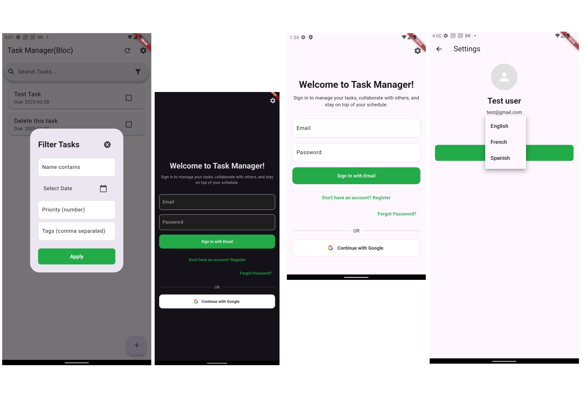

# Task Manager

Task Manager is a Flutter application built using Clean Architecture and flutter_bloc, designed to mimic Todoist features. It supports task management with calendar synchronization, collaborator sharing, live user presence, task filtering, and more.



**Documentation:** [https://brianmuigai.github.io/Task-Manager/](https://brianmuigai.github.io/Task-Manager/)

## Features

- **Task Management:**  
  Create, update, and delete tasks with a start time and due datetime.

- **Calendar Sync:**  
  Automatically sync tasks to the device calendar (with update and delete functionality for calendar events).

- **Collaborator Sharing:**  
  Add collaborators, filter them via search, and view live editing status.

- **Filtering:**  
  Filter tasks by name, date, priority, or tags.

- **Authentication:**  
  Sign in with Google or email/password; includes registration and password reset functionality.

- **Local Emulator Support:**  
  Prototype and test using the Firebase Local Emulator Suite.

- **Firestore Security:**  
  Secure access with Firestore rules ensuring that only authenticated users (and appropriate collaborators) can access tasks.

- **Reminders & Alerts:**  
  (Server-side) Cloud Functions to send push notifications when tasks are due soon.

## Architecture

Task Manager follows a Clean Architecture approach, structured into three primary layers:

- **Domain Layer:**  
  Contains core business entities (e.g., Task, AppUser), repository interfaces, and use cases for each feature.

- **Data Layer:**  
  Implements data sources (Firestore, Device Calendar), models (mapping Firestore documents to domain entities), and repository implementations.

- **Presentation Layer:**  
  Manages the UI, state management via flutter_bloc, and user interactions, with organized pages, widgets, and BLoC components.

The folder structure is organized as follows:

```
lib/
 ├── core/           # Shared utilities and validators
 ├── data/
 │     ├── datasources/
 │     ├── models/
 │     ├── repositories/
 │     └── services/
 ├── domain/
 │     ├── entities/
 │     ├── repositories/
 │     └── usecases/
 ├── presentation/
 │     ├── bloc/
 │     ├── pages/
 │     └── widgets/
 └── main.dart
```

## Getting Started

### Prerequisites

- Flutter SDK  
- Dart SDK  
- Firebase CLI (for emulators and functions)  
- A Firebase project configured for your app

### Setup

1. **Clone the Repository:**

   ```bash
   git clone https://github.com/BrianMuigai/Task-Manager.git
   cd Task-Manager
   ```

2. **Install Dependencies:**

   ```bash
   flutter pub get
   ```

3. **Generate Mocks and Code:**

   Run the following command in your project root:

   ```bash
   dart run build_runner watch --delete-conflicting-outputs
   ```

4. **Firebase Setup:**

   - Configure your Firebase project and add the required configuration files (e.g., `google-services.json` for Android, `GoogleService-Info.plist` for iOS).
   - Install Firebase CLI if not already installed:

     ```bash
     npm install -g firebase-tools
     ```

## Prototype and Test with Firebase Local Emulator Suite

You can prototype and test your app with the Firebase Local Emulator Suite, which includes an Authentication emulator, Firestore emulator, Functions emulator, and more.

From the root directory, run:

```bash
firebase emulators:start
```

This command spins up a local environment that mimics your Firebase project, allowing your app to interact with emulated database content, functions, and security rules.

## Firestore Security

In your Firebase console, set Firestore rules to restrict access and allow collaboration. For example:

```js
rules_version = '2';
service cloud.firestore {
  match /databases/{database}/documents {
    match /tasks/{taskId} {
      // Allow access only to authenticated users.
      // For collaboration, ensure the user is the owner or in the collaborators array.
      allow read, write: if request.auth != null &&
         (request.auth.uid == resource.data.ownerId ||
          (resource.data.collaboratorIds != null &&
           request.auth.uid in resource.data.collaboratorIds));
    }
  }
}
```

## Server Setup

Below is a documentation section you can include in your README (or a separate docs file) that explains the Cloud Functions folder structure and details the contents of each file, including the full content of **notifications_helper.js**.

---

## Cloud Functions

The project includes a set of Cloud Functions under the **functions** folder. This folder is structured as follows:

- **node_modules/**  
  Contains all the dependencies installed for the Cloud Functions.

- **index.js**  
  The main entry point for your Cloud Functions. This file imports and exports your functions so that Firebase can deploy them.

- **notifications_helper.js**  
  This file contains helper functions used for sending push notifications. It defines functions to:
  - **Determine if a task is due soon:** The `isDueSoon()` function checks if a task’s due date is within the next hour.
  - **Retrieve FCM tokens:** The `getUserTokens()` function fetches FCM tokens for a given task owner and any collaborators from the Firestore "users" collection.
  - **Send Due Date Reminders:** The Cloud Function `sendDueDateReminder` listens for updates on tasks (in the `tasks/{taskId}` collection) and, if the task’s due date is near, sends a push notification via FCM.

- **package.json**  
  This file contains the configuration for the Cloud Functions project including the dependencies (such as `firebase-functions` and `firebase-admin`) and scripts needed to deploy your functions.

---

This documentation outlines the structure and purpose of the Cloud Functions in your project, and provides the complete code for **notifications_helper.js**, which is responsible for sending due date reminders using Firestore triggers and FCM notifications..


## Testing

This project uses Mockito for unit testing. Tests are organized by feature:

```
test/
 ├── auth/
 │     ├── reset_password_test.dart
 │     ├── register_with_email_password_test.dart
 │     ├── sign_in_with_email_password_test.dart
 │     ├── sign_in_with_google_test.dart
 │     └── search_users_test.dart
 ├── tasks/
 │     ├── add_task_test.dart
 │     ├── delete_task_test.dart
 │     ├── get_tasks_test.dart
 │     ├── update_task_test.dart
 │     └── get_tasks_stream_test.dart
 └── calendar/
       ├── add_task_to_calendar_test.dart
       └── delete_task_from_calendar_test.dart
```

Generate mocks with:

```bash
flutter pub run build_runner build
```

Then run tests:

```bash
flutter test
```
